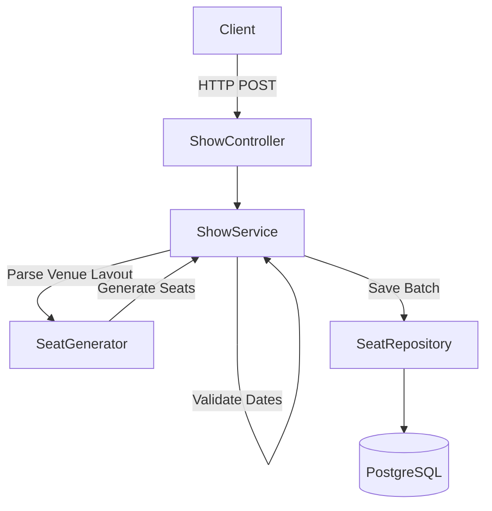

# Architecture

The TicketRush architecture follows a classic layered MVC style using Spring Boot.

## Layers
- **Controllers**: Handle HTTP mapping, validation, and JSON conversion.
- **Services**: Contain business logic, boundary transactions, and coordination.
- **Repositories**: Handle Data Access using Spring Data JPA.
- **Entities**: Mapped to database tables.
- **DTOs**: Data Transfer Objects isolate our API contract from our persistence layer.

## Request Flow

